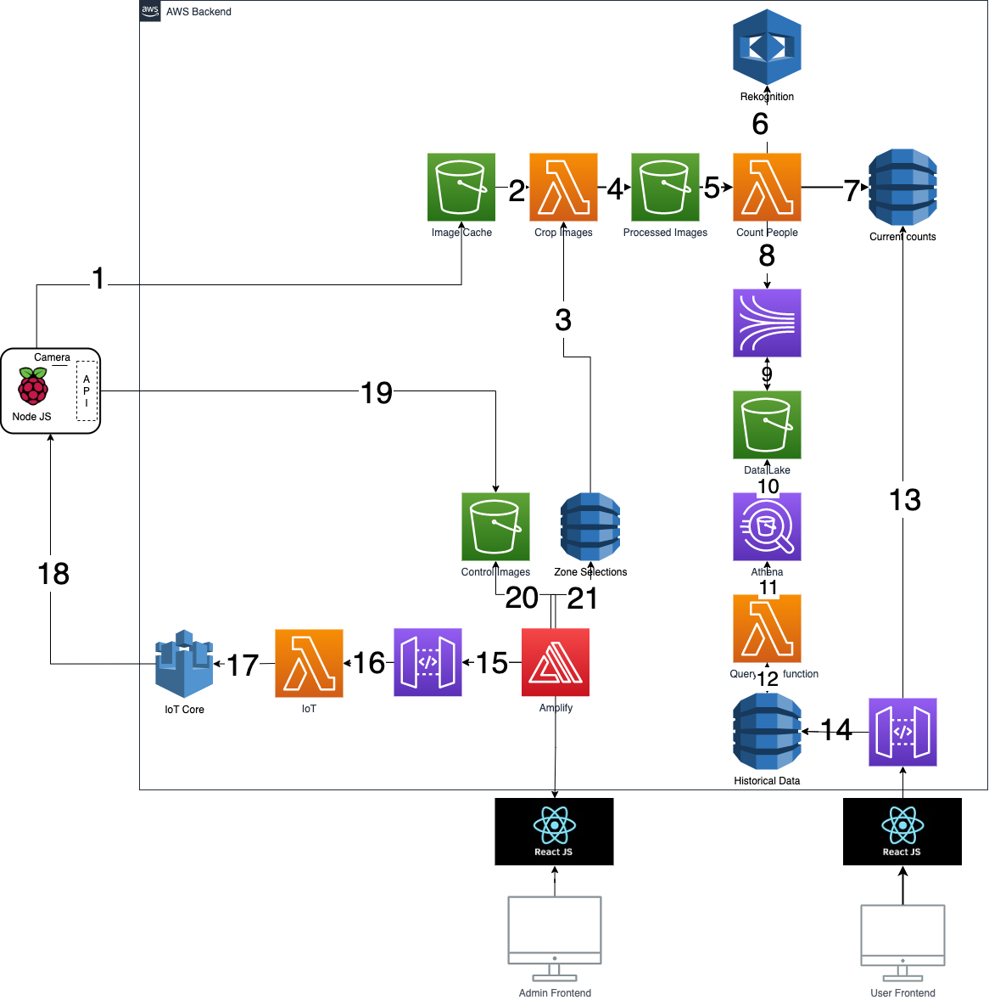

## Description

The solution then monitors the movement into and out of designated ‘zones’ the [https://cic.ubc.ca/project/people-density-meter/](project) was intiated to focus on monitoring dining stations within a servery and counting  how many people are in each zone. This provides a measure of occupancy to help staff manage the number of people in the servery and informs students if the servery is busy in near-real-time. Current count data per station and zone along with historical average data per station and zone can be accessed via an API.

This repository contains instructions on how to set-up the AWS backend as well as the administrator dashboard application.
[People Counting with RaspberryPi](https://github.com/UBC-CIC/people-counting-with-aws-rekognition-RaspberryPi-IOT) contains the 
remaining part of the instructions.

## Cloud Architecture

Cloud architecture diagram and its description are provided [here](./docs/cloudArchitecture.md)

## Frontend Guide

Details on how to use the administrator dashboard are provided [here](./docs/frontend.md)

## Deployment
To deploy this solution into your AWS Account please follow our [Deployment Guide](./docs/deployment.md)

## License
This project is distributed under the  [Apache License 2.0](https://github.com/UBC-CIC/vgh-covid-19-ct-model/blob/master/LICENSE) 

## Related Projects

[People Counting with RaspberryPi](https://github.com/UBC-CIC/people-counting-with-aws-rekognition-RaspberryPi-IOT)

[User Website](https://github.com/UBC-CIC/people-counting-with-aws-rekognition-User-Website)

## Credits 

This prototype was developed  by UBC CIC student [Arman Zhakypbekov](https://github.com/armanzm) with assistnce from [Aamir Sheergar](https://github.com/AamirL1011) and the CIC technical team.
