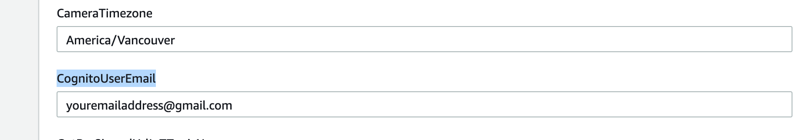
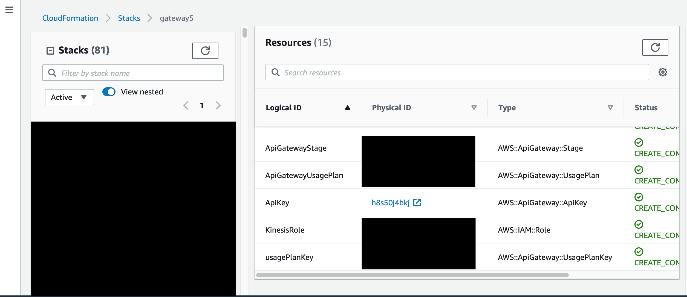
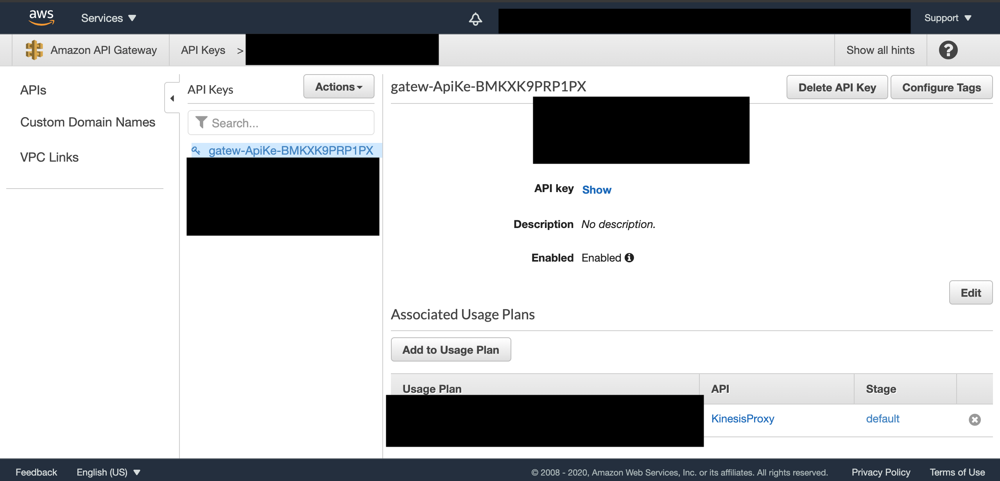

# Requirements
Before you deploy, you must have the following in place:
*  [AWS Account](https://aws.amazon.com/account/) 
*  [GitHub Account](https://github.com/) 
*  [Node 12.6.0 or greater and NPM 6.14.10 or greater](https://nodejs.org/en/download/) 
*  [Amplify CLI installed and configured](https://aws-amplify.github.io/docs/cli-toolchain/quickstart#quickstart) 
*  [AWS CLI installed and configured](https://aws.amazon.com/cli/) 


# Step 1: Front-end deployment

1.  Fork and clone this repository.
    If you haven't configured Amplify before, configure the Amplify CLI in your terminal as follows:
```bash
amplify configure
```

2.  In a terminal from the project root directory, enter the following command selecting the IAM user of the AWS Account you will deploy this application from. (accept all defaults):

```bash
amplify init
```

3.  Deploy the resourse to your AWS Account using the command:
```bash
amplify push
```

4.  After the Amplify deployment finishes, go to the **scripts** directory and run the [populateParameterStore.sh](../scripts/populateParameterStore.sh) script. 
    This will setup the necessary parameters for the backend cloudformation stack:
```bash
chmod a+x ./populateParameterStore.sh 
./populateParameterStore.sh
```
5. Use npm to install the dependencies and run it locally. 
```bash
npm install
```
# Step 2: Back-end deployment

* [cfn-backend](../backend/cfn-backend.yaml) - Responsible for the creation of the underlying infrastructure of the solution.

## Step 2.1: Deploy the back-end cloudformation stack

1. Log into the AWS CloudFormation Management Console.
2. Select Create stack with the With new resources option.
3. **Specify template section**: Click Upload a template file, and then Choose file and select the **cfn-backend.yaml** file
4. **Specify stack details section**: Name the stack (e.g. peopleCountingWithRekognition). Rename the parameters shown in the picture below:



Use a valid email address and timezone. You will receive the login credentials for the front-end application on this
email address.

5. **Configure stack options section**: Click next
6. **Review section**: Tick the "I acknowledge that ..." box and click "Create stack"

## Step 2.2: Upload the code for Lambda functions

Run the [uploadLambdas.sh](../scripts/populateParameterStore.sh) script which will upload the Lambda function code to AWS.
```bash
chmod a+x ./scripts/uploadLambdas.sh 
./scripts/uploadLambdas.sh
```
## Step 3: Setting up user and admin front-end applications.

In this section we will update the front-end application code to enable the communication with AWS IoT Core.

1.Select the stack that you created in Cloudformation. Click on **Resources** in the right pane :



2.You should find clickable links for resources named **ApiKeyDeveloperEndpoint** and **ApiKeyIoT**. 



Click on **Show**. Make note of the API key that is displayed to you. 

3.Select outputs section of your cloudformation stack.


Make note of the **IoTEndpoint** and **DeveloperEndpoint** urls.

Paste the API key and endpoint url into the appropriate fields in the [secrets](../src/secrets.json) file. 