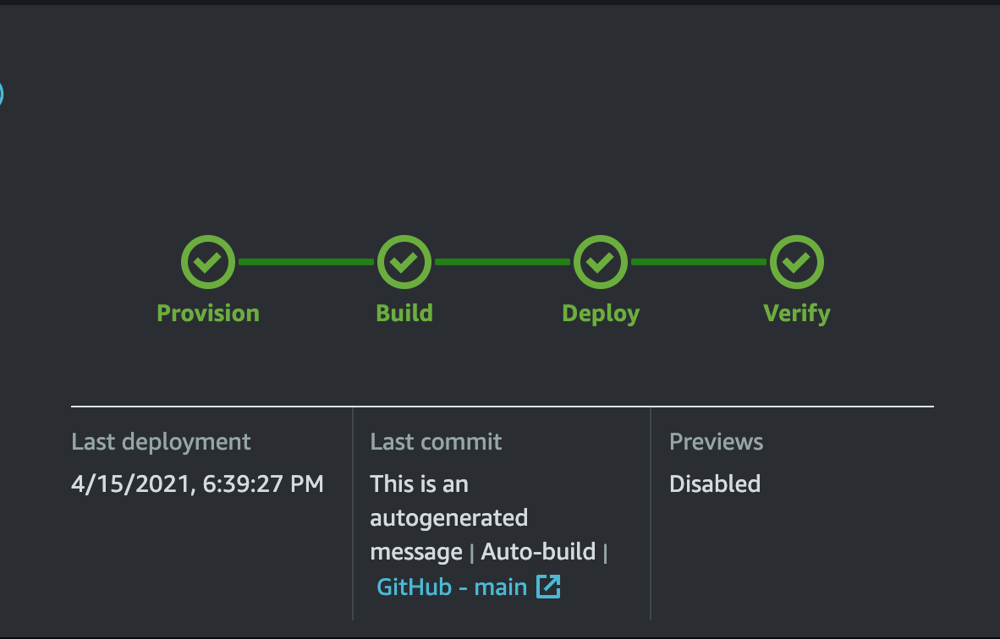

# Requirements
Before you deploy, you must have the following in place:
*  [AWS Account](https://aws.amazon.com/account/) 
*  [GitHub Account](https://github.com/) 
*  [Node 12.6.0 or greater and NPM 6.14.10 or greater](https://nodejs.org/en/download/) 
*  [Amplify CLI installed and configured](https://aws-amplify.github.io/docs/cli-toolchain/quickstart#quickstart) 
*  [AWS CLI installed and configured](https://aws.amazon.com/cli/) 
*  [SAM CLI](https://docs.aws.amazon.com/serverless-application-model/latest/developerguide/serverless-sam-cli-install.html)
*  [Python 3.6 or greater](https://www.python.org/downloads/)

# Step 1: Front-end deployment

The **Deploy to Amplify Console** button will take you to your AWS console to deploy the front-end solution.

<a href="https://console.aws.amazon.com/amplify/home#/deploy?repo=https://github.com/UBC-CIC/people-counting-with-aws-rekognition-Admin-Website">
    
</a>

1. 
   
2. 
   
3. 

# Step 2: Back-end deployment

Make sure to deploy the backend in the same account as the front-end from the previous step.

1. Go to the **scripts** directory and run the [deploy.sh](../scripts/deploy.sh) script.

```bash
chmod a+x deploy.sh 
./deploy.sh
```

2. You will see the prompt shown below. Here are the instructions on what you should enter:

* **Stack Name**, **AWS Region**: choose the stack name and the region you want to deploy in. You should use the same region you deployed the front-end in **Step 1** of the instructions.
    
* **CognitoUserEmail** : use a valid email address. You will receive the login credentials for the front-end application on this
email address.
  
* Select all defaults for everything else (Press enter to select default).

```bash
Configuring SAM deploy
======================

        Looking for config file [samconfig.toml] :  Not found

        Setting default arguments for 'sam deploy'
        =========================================
        Stack Name [sam-app]: yourstackname
        AWS Region [us-west-2]: 
        Parameter CognitoUserEmail [youremail@gmail.com]: 
        Parameter RekognitionBucketName [rekognitionbucket-people-counting]: 
        Parameter ImageProcessingBucketName [imageprocessingbucket-people-counting]: 
        #Shows you resources changes to be deployed and require a 'Y' to initiate deploy
        Confirm changes before deploy [y/N]: 
        #SAM needs permission to be able to create roles to connect to the resources in your template
        Allow SAM CLI IAM role creation [Y/n]: 
        Save arguments to configuration file [Y/n]: 
        SAM configuration file [samconfig.toml]: 
        SAM configuration environment [default]:
```

3. The terminal output will have the Api Key and Endpoint URL which you will use to connect the user frontend to the backend. 
   No further action is required for the administrator website since it gets connected to the backend automatically.
   
```bash
------------------------ Use The Following Values To Get Counts ------------------------
HTTPEndpointURL : yourendpointURL
HTTPEndpointAPIKey : yourAPIKey
```