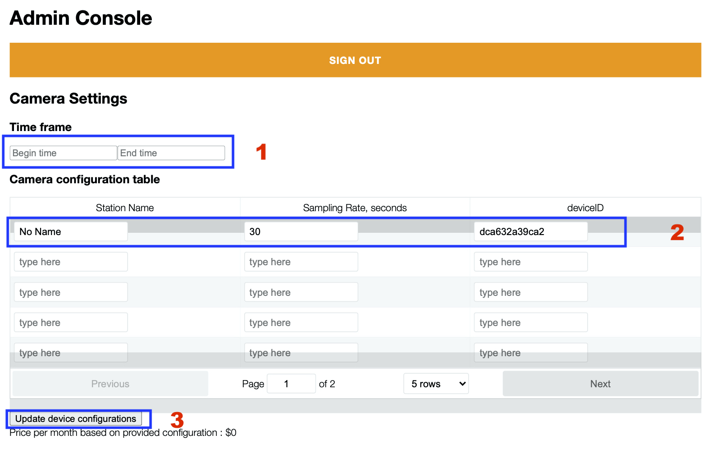
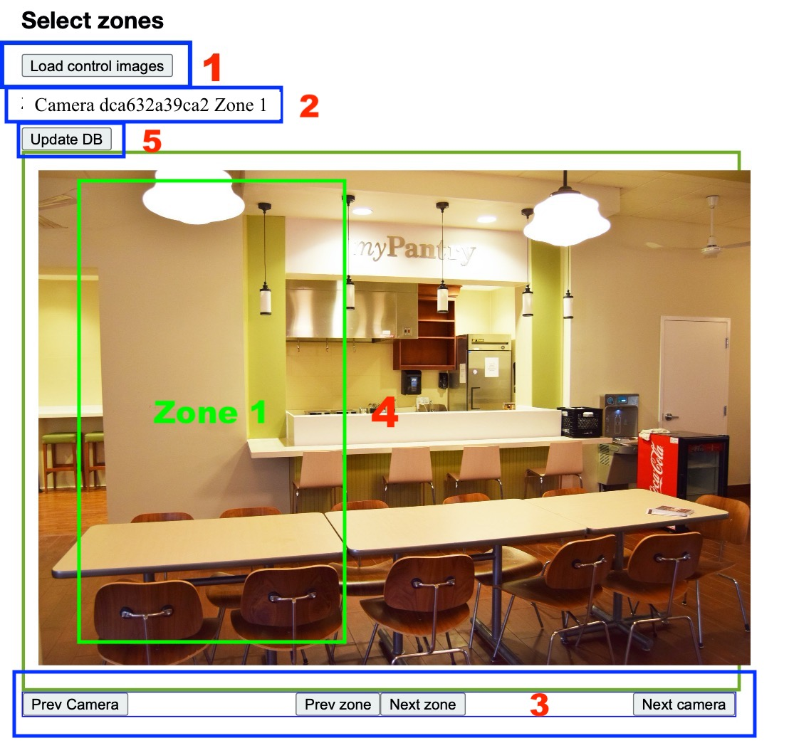

## Administrator website: Upper Half

This part of the website allows the administrator to set up and modify camera settings. The steps to setup settings for all cameras is as follows (numbers correspond to what is shown in the image): 

1. **Set the time frame for image capture**:
This allows the user to set the time window for monitoring. For example, Begin time can be 7:00 and End time can be 20:00. This would mean that the camera would turn off at 20:00 and no images would be captured or used between that time and 6:59.  This would allow costs to be managed (there would be no charges outside the time frame other than the electricity bill).
2. **Specify the camera, station and sampling rate**:
   The administrator would choose the settings for each registered device in the camera configuration table. This requires specifying the Station (e.g. Sandwiches) at which the camera (i.e. deviceID) is looking at (see also next section).  Here, the user also selects a sampling rate (rate at which the images are taken). Note:  Once this is initiated, settings are retained and automatically loaded in this page so you can see the settings and don’t have to re-enter this information every time.
3. **Save the change**:
   To save the configuration settings or changes, the administrator presses on the “Update device configurations” button to send the updated settings to all of the registered devices. 

## Administrator website: Lower Half

This part of the website allows the user to create the ‘zones’ for each wait line. A zone delineates the section of the image in which to count humans and can be specified by a rectangle (shown in green). The following functions are shown on this screen and numbers indicate the sequence they are relevant in the process:v

1. **Load control images button**:  The administrator clicks “Load control images” button to send a command to all cameras to capture an image and display it on the administrator website. You don’t need to refresh the page. The images will appear in about 3-4 seconds after the button is pressed.
2. **DeviceID**:  This is a text field showing the deviceID of the camera which captured the shown image. You should use this information to select the station name in the camera configuration table described above.
3. **“Prev Camera” and “Next Camera” buttons**:  These buttons are used for navigation. “Prev Camera” and “Next Camera” buttons update the text field with the deviceID as well as the image of another camera.
4. **Selecting the zone**:  The administrator uses the mouse to select/create the rectangle of the current zone. Use “Prev Zone” and “Next Zone” buttons to change the zone number in the text field and select a new rectangle. Rectangles for a particular camera should not overlap.
5. **Update DB button**:  The administrator presses the “Update DB” button to send the rectangle coordinates and station name for each camera. After this the people counting program will know how to split the image into smaller parts using the zones you selected.
